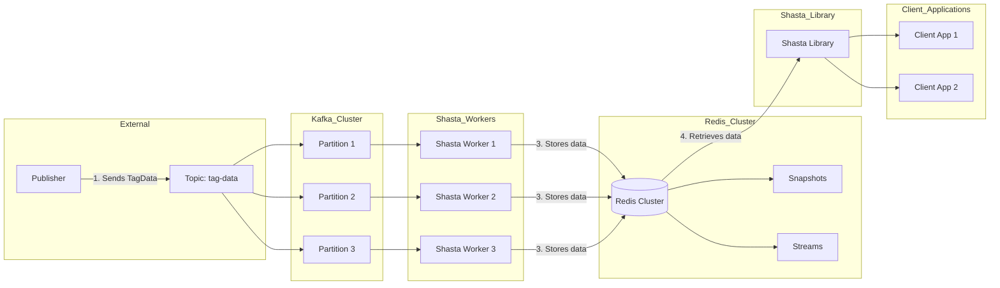

# Goals
- Measure producer to consumer latency per event
- Aggregate latency data (mean, median, etc.)
- Tune MSK to handle:
  - 1,000 producer connections
  - Each producer posting 1 event/second
  - 4 EC2 instances as Shasta workers
  - 99.99% of the time, latency < 100ms

# High-Level Overview of Shasta

## Architecture
- Shasta uses AWS services for scalability and reliability:
  - AWS MemoryDB for Redis: Fully managed Redis-compatible in-memory database
  - Amazon MSK (Managed Streaming for Apache Kafka): Fully managed Apache Kafka service

## Key Components
- **Shasta Worker**: Consumes messages from Kafka, processes them, and stores data in Redis
- **Shasta Library**: Interfaces with Redis to retrieve and manage data

## Data Flow
1. Publisher sends TagData messages (avg event size 512 bytes) to Kafka topic
2. Shasta Worker consumes messages from Kafka
3. Worker processes messages and stores data in Redis
   - Snapshots stored as hashes
   - Deltas stored in Redis streams
4. Shasta Library retrieves data from Redis
   - Snapshots retrieved from hashes
   - Deltas retrieved from streams
## Architecture Diagram

## Benefits of AWS Services
### AWS MemoryDB for Redis
- Fully managed, highly available Redis service
- Automatic failover and data replication
- No need to manage Redis infrastructure

### Amazon MSK (Managed Streaming for Kafka) 
- Fully managed Apache Kafka service
- Automatic scaling, high availability, and data durability
- Simplified Kafka cluster management

## MSK Configuration

The Amazon MSK (Managed Streaming for Apache Kafka) service is configured using the AWS Cloud Development Kit (CDK) with the following properties:

- `kafkaVersionsList`: The list of supported Apache Kafka versions. In this case, version 3.3.2 is used.
- `serverProperties`: A string containing the server configuration properties for the Kafka brokers. The properties are as follows:
  - `auto.create.topics.enable=true`: Automatically create new topics when a producer starts writing to or a consumer starts reading from a non-existent topic.
  - `default.replication.factor=3`: The default number of replicas for each partition in a topic. A value of 3 ensures data durability and fault tolerance.
  - `min.insync.replicas=2`: The minimum number of in-sync replicas required for a write operation to be considered successful. This ensures data consistency.
  - `num.io.threads=32`: The number of I/O threads for the Kafka brokers to handle I/O operations.
  - `num.network.threads=16`: The number of network threads for the Kafka brokers to handle network requests.
  - `num.partitions=1`: The default number of partitions for new topics.
  - `num.replica.fetchers=8`: The number of replica fetcher threads for the Kafka brokers to replicate messages from leaders.
  - `replica.lag.time.max.ms=30000`: The maximum time in milliseconds that a replica can lag behind the leader before it is considered out of sync.
  - `socket.receive.buffer.bytes=1024000`: The size of the TCP receive buffer for the Kafka brokers.
  - `socket.request.max.bytes=104857600`: The maximum size of a request that the Kafka broker will accept.
  - `socket.send.buffer.bytes=1024000`: The size of the TCP send buffer for the Kafka brokers.
  - `unclean.leader.election.enable=false`: Disable unclean leader election to prevent data loss.
  - `zookeeper.session.timeout.ms=18000`: The session timeout in milliseconds for ZooKeeper.

These configuration properties are optimized for the specific requirements of the Shasta system, ensuring optimal performance, data durability, and fault tolerance.

# Latency Path Overview

Kafka Producer -> Consumer Group Worker

## Shasta Clients Configuration

- EC2 Instances: 128 m7.2xlarge
- Producers per Instance: 8 

## Consumer Group Configuration

- EC2 Instances: 8 m7.2xlarge

## MSK Cluster Configuration 

- Instance Type: kafka.m7g.2xlarge (Graviton)
- Brokers: 3, spanning 3 Availability Zones (AZs)
- https://aws.amazon.com/msk/pricing/

## Kafka Configuration

- Partitions: 256
- Replication Factor: 3

## EC2 Pricing

- Hourly On-Demand (m7i.2xlarge): $0.4032
- Reserved Instance Hourly: $0.267

## Load Test Results

### 8 producers, 8 workers, 6hr test, 2pps

| Metric | Median | Mean | StdDev | Max | Min |
|--------|--------|------|--------|-----|-----|
| D2     | 37.0   | 37.34 | 0.81  | 40.0 | 35.0 |
| D3     | 400.56 | 405.54 | 67.87 | 659.06 | 177.52 |
| D4     | 1298.53 | 1264.58 | 202.93 | 1750.35 | 567.75 |
| D5     | 1663.61 | 1651.99 | 217.17 | 2495.94 | 894.42 |

### 4 producers, 8 workers, 6hr test, 2pps, v1

| Metric | Median | Mean | StdDev | Max | Min |  
|--------|--------|------|--------|-----|-----|
| D2     | 104.0  | 104.44 | 3.8   | 115.0 | 91.0 |
| D3     | 2223.99 | 2205.73 | 292.72 | 2780.82 | 962.88 |
| D4     | 4291.08 | 4525.5 | 932.74 | 6893.22 | 2918.79 |
| D5     | 5249.89 | 5620.49 | 1234.84 | 8275.47 | 3577.32 |

### 4 producers, 8 workers, 6hr test, 2pps, v2

| Metric | Median | Mean | StdDev | Max | Min |
|--------|--------|------|--------|-----|-----|
| D2     | 129.0  | 232.4 | 182.54 | 632.05 | 108.0
| D3     | 2496.11 | 2612.54 | 1715.5 | 41508.18 | 978.91 |
| D4     | 5065.1 | 4879.83 | 2298.37 | 52339.16 | 2974.08 |
| D5     | 6121.34 | 5746.24 | 2445.25 | 53764.14 | 3250.0 |

### 4 producers, 8 workers, 6hr test, 2pps, v3

| Metric | Median | Mean | StdDev | Max | Min |
|--------|--------|------|--------|-----|-----|
| D2     | 132.0  | 132.22 | 5.2   | 155.0 | 112.0 |
| D3     | 2560.89 | 2561.61 | 367.55 | 3377.71 | 1032.36 |
| D4     | 5003.0 | 4941.79 | 499.76 | 6437.23 | 3490.81 |
| D5     | 6135.8 | 6255.18 | 627.24 | 8141.88 | 4906.39 |

### 8 producers, 8 workers, 12hr test, 1pps

| Metric | Median | Mean | StdDev | Max | Min |
|--------|--------|------|--------|-----|-----|
| D2     | 13.0   | 12.71 | 0.53  | 14.0 | 11.0 |
| D3     | 53.79  | 58.04 | 14.18 | 143.74 | 37.22 |
| D4     | 400.25 | 441.81 | 165.41 | 992.43 | 160.69 |
| D5     | 847.38 | 859.76 | 317.69 | 2671.94 | 266.47 |

### 8 producers, 8 workers, 6hr test, 2pps, 8xlarge

| Metric | Median | Mean | StdDev | Max | Min |
|--------|--------|------|--------|-----|-----|
| D2     | 18.0   | 18.41 | 5.1   | 30.0 | 7.0 |
| D3     | 129.24 | 133.51 | 40.27 | 311.1 | 54.0 |
| D4     | 712.51 | 708.6 | 151.96 | 1129.24 | 328.78 |
| D5     | 980.7  | 989.64 | 164.59 | 2092.23 | 506.28 |

### 8 producers, 8 workers, 6hr test, 2pps, 8xlarge, gc64GB

| Metric | Median | Mean | StdDev | Max | Min |
|--------|--------|------|--------|-----|-----|
| D2     | 12.42  | 16.24 | 7.68  | 31.0 | 7.0 |
| D3     | 180.49 | 175.53 | 55.45 | 323.18 | 51.0 |
| D4     | 648.14 | 632.44 | 123.51 | 923.54 | 239.07 |
| D5     | 889.37 | 882.11 | 132.12 | 1196.77 | 421.0 |

### 16 producers, 8 workers, 6hr test, 2pps, 8xlarge, gc64GB

| Metric | Median | Mean | StdDev | Max | Min |
|--------|--------|------|--------|-----|-----|
| D2     | 20.0   | 18.8  | 7.89  | 34.0 | 4.0 |
| D3     | 48.67  | 90.79 | 374.27 | 8888.66 | 39.94 |
| D4     | 547.72 | 1273.73 | 2980.62 | 21471.16 | 54.0 |
| D5     | 1122.64 | 1972.88 | 3558.71 | 23242.55 | 63.26 |

### 4 producers, 8 workers, 12hr test, 0.5pps, 8xlarge, gc64GB

| Metric | Median | Mean | StdDev | Max | Min |
|--------|--------|------|--------|-----|-----|
| D2     | 6.0    | 6.57  | 0.64  | 9.0  | 5.0 |
| D3     | 49.91  | 49.9  | 12.22 | 112.79 | 20.93 |
| D4     | 369.63 | 471.3 | 303.19 | 1873.4 | 98.19 |
| D5     | 930.82 | 989.36 | 488.21 | 2786.01 | 207.37 |

### docker, 4 producers, 24 workers, 1pps, 8xlarge

| Metric | Median | Mean | StdDev | Max | Min |
|--------|--------|------|--------|-----|-----|
| D2     | 30.0   | 31.17 | 4.32  | 40.0 | 25.0 |
| D3     | 7486.06 | 7141.79 | 6990.72 | 14774.86 | 52.0 |
| D4     | 18731.19 | 14536.95 | 7608.28 | 19886.84 | 62.0 |
| D5     | 20300.27 | 18921.16 | 2803.21 | 21505.16 | 10891.0 |

  
**Notes:** 
Above test runs typically use 128 ec2 instances w/ n producers per instance.  Unless stated otherwise, each producer sends 1 event per second. On consumer group side, 8 ec2 instances are used.

The D2-D5 metrics quantify the tail latencies in the system by calculating the differences between higher percentile latencies (99th, 99.9th, 99.99th, 99.999th) and the median latency for each unique pair of source and destination instrumentation identifiers. 

The process involves several steps:

1. Collect latencies: For each entry in the input data, extract the latency (afterConsume - beforePublish) if the required keys are present. Store these latencies in a dictionary, grouped by the unique pair of source and destination instrumentation identifiers.

2. Calculate differences from median: For each pair of identifiers, calculate the median latency. Then compute the differences between the latencies at the 99th, 99.9th, 99.99th, and 99.999th percentiles and the median. These differences are stored as D2, D3, D4, and D5 respectively for each pair.

3. Aggregate differences: Collect all the D2-D5 differences across all pairs into a single dictionary. This aggregates the differences irrespective of the specific identifier pairs.

4. Compute statistics: For each of the aggregated D2-D5 metrics, calculate statistical measures like median, mean, standard deviation, max, and min using NumPy functions. 

The resulting statistics provide insights into the distribution and magnitude of the tail latencies across all identifier pairs in the system. Higher values of D2-D5 indicate larger deviations of the tail latencies from the median, suggesting potential performance issues or anomalies that may require further investigation.
